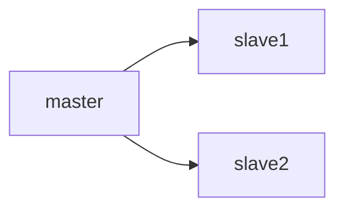
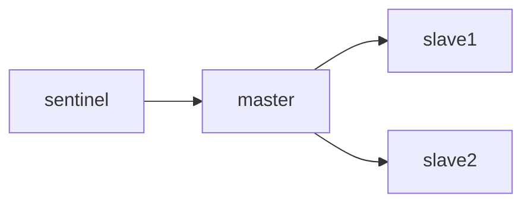

# Redis

## Referência

https://redis.io/

## Conceitos

- Banco de dados chave / valor
- Persistência dos dados não é a prioridade e sim a replicação
- Tipos de valores: primitivos (string, números, lógicos), listas, conjuntos, hash e conjuntos ordenados

## Redis na Cloud

- Redis pode ser acessado na Cloud [AQUI](https://app.redislabs.com/#/login)

## Inslatando no Linux (Alpine)

[Docker Playground](https://labs.play-with-docker.com/)

- Executar as instruções abaixo para a instalação
```bash
apk update
apk add redis
```
- Iniciar o servidor

```bash
redis-server --protected-mode no &
```
- Iniciar o cliente e testar
```bash
redis-cli
ping
```
- Iniciar o cliente remoto
```bash
redis-cli -h IP_SERVIDOR
ping
```

## Dados Prioritariamente em Memória

- `SET msg alo`
- Parar o servidor: `redis-cli shutdown`
- Iniciar o servidor
- `GET msg`
  
## Comandos

- Criar, recuperar e remover uma chave (encerar o server e observar que a chave pode ser perdida)
```
SET SP;RJ 400Km
GET SP;RJ
KEYS *
DEL SP;RJ
```
- Outras operações
    - `INCR`: incrementa em uma unidade
    - `DECR`: decrementa em uma unidade
    - `INCRBY`: incrementa em X unidades
    - `DECRBY`: decrementa em X unidades
    - `APPEND`: concatena uma `String` ao valor (também `String`) de uma chave
    - `GETRANGE`: obtem uma substring do valor associado a uma chave

- **Exercício**: Quatro equipes de futebol de enfrentam em dois jogos simultâneos. Como controlar o placar dos jogos utilizando *Redis*? Considere também a possibilidade do cancelamento de gols.

## Expirando Chaves

- Pode-se determinar um tempo de "vida" para chaves criadas com o `EXPIRE`
```
SET MENSAGEM Oi
GET MENSAGEM
EXPIRE MENSAGEM 10
```

## Listas

- Uma única chave pode ter mais de um valor associado
- Novos valores são adicionados à direita da lista (item 1 -> item 2 -> item n) com `RPUSH` ou à esquerda com `LPUSH`
- Valores são removidos da esquerda com o `LPOP` ou da direita com o `RPOP`
- Para listar todos os valores utilizar o `LRANGE`
- O índice de um valor pode ser obtido por meio do `LINDEX`
- `LTRIM` remove elementos de uma lista fora de um intervalo definido
- `RPOPLPUSH` remove um elemento da direita de uma lista e adiciona à esquerda em outra

```
RPUSH SP;RJ 400Km R$700,00
LRANGE SP;RJ 0 -1
LINDEX SP;RJ 0
```
- **Exercício**: verificar se a expressão `(10 * 2 + (3 -1)` está correta quanto à quantidade de parêntesis abertos e fechados
- **Exercício**: construir um sistema de senhas de atendimento em uma agência bancária considerando uma fila normal e também uma prioritária
- **Exercício**: controlar uma lista de compras com itens que devem ser comprados no mercado e os que já foram colocados no carrinho

## Conjuntos (Sets)

- Diferem das listas por não permitirem valores duplicados para uma mesma chave
- Principais comandos
  - `SADD`:  adiciona / cria um Set incluindo itens
  - `SMEMBERS`: retorna todos os itens de um Set
  - `SISMEMBER`: verifica se um item pertence ao Set
  - `SREM`: remove um item do Set (se existir)
  - `SCARD`: retorna o número total de itens do Set
  - `SRANDMEMBER`: retorna um item aleatório
  - `SPOP`: remove itens da esquerda
  - `SMOVE`: move itens de um set para outro
  - `SDIFF`: retorna os elementos distintos entre conjuntos
  - `SDIFFSTORE`: mesmo que anterior só que inclui itens no conjunto destino
  - `SINTER`: retorna elementos em comum entre conjuntos
  - `SINTERSTORE`: mesmo que anterior só que inclui itens no conjunto destino
  - `SUNION`: une os dois conjuntos sem repetir itens
  - `SUNIONSTORE`: mesmo que anterior só que inclui itens no conjunto destino

- **Exercício**: criar um controle de ocupação de assentos em um vôo (RDIS888) onde devem fazer parte do conjunto as identificações dos assentos já ocupados:
  - Antes de reservar um assento verificar se ele já está alocado no vôo
  - Oferecer a opção de cancelamento da reserva do assento no vôo
  - Criar um segundo vôo (RDIS999) e reservar alguns assentos
  - Verificar quais assentos são comuns e distintos entre os dois vôos
  - Transferir todos os assentos que não são comuns para um terceiro vôo (RDI000)

## Hash

- Hashes podem ser vistos como sub-chaves e comparados a registros em um banco de dados relacional ou ainda adocumentos em bancos de dados noSQL
- Principais operações:
  - `HMSET`: cria / atualiza chaves (mais de uma)
  - `HGET`: retorna o valor de uma chave
  - `HMGET`: retorna valores de chaves
  - `HDEL`: remove uma chave
  - `HLEN`: retorna a quantidade de chaves
  - `HEXISTS`: verifica se uma sub-chave existe
  - `HKEYS`: retorna todas as sub-chaves
  - `HVALS`: retorna todos os valores armazenados nas sub-chaves
  - `HINCRBY` à incrementa uma sub-chave baseado em um valor inteiro
  - `HINCRBYFLOAT` à incrementa uma sub-chave baseado em um valor decimal

```
HSET SP;BH distancia 600 preco 800.0 empresa TAM
HGETALL SP;BH
HGET SP;BH preco
HDEL SP;BH empresa
```
- **Exercício**: criar uma estrutura para armazenar o nome de um aluno, sua turma e semestre (escolher a chave apropriadamente). Atualizar o semestre atual.

## ZSet

- ZSets se assemelham aos Hashes mas as chaves (membros) são únicas e os valores (scores) devem ser apenas números
- Itens podem ser acessados de maneira ordenada
- Principais operações:
  - `ZADD`: cria um novo membro para o conjunto
  - `ZINCRBY`: incrementa o score de um membro em determinada quantidade
  - `ZREM`: remove membros
  - `ZCARD`: retorna o número de membros
  - `ZCOUNT`: retorna a quantidade de membros com o score entre os parâmetros informados
  - `ZRANK`: retorna a posição do membro de acordo com o seu score
  - `ZSCORE`: retorna o score de um membro
  - `ZRANGEBYSCORE`: retorna os membros cujo score estejam entre determinado intervalo

- **Exercício**: armazenar a quantidade de gols marcados por um jogador em determinado campeonato.

## Coordenadas Geográficas

- É possível armazenar coordenadas geográficas (latitude / longitude)
- O comando `GEOADD` adiciona uma coordenada

```bash
GEOADD bikes:rentable -122.27652 37.805186 station:1
GEOADD bikes:rentable -122.2674626 37.8062344 station:2
GEOADD bikes:rentable -122.2469854 37.8104049 station:3
```
- Pode-se consultar coordenadas com base em um raio de distância:
```bash
GEOSEARCH bikes:rentable FROMLONLAT -122.2612767 37.7936847 BYRADIUS 5 km WITHDIST
```
## Streams
- Permite criar *streams* de dados síncronos (* gera o id do evento automaticamente)
```
XREAD BLOCK 0 STREAMS eventos $
XADD eventos * tipo click
```
***
## Use Cases

## Eleição das Cores
- Criar uma aplicação nodejs para exibir três cores em uma página web e permitir que os usuários votem em uma determinada cor e armazenando o voto em um banco de dados **Redis**
#### Instruções
- Instalar o **Redis** no [Docker Playground](https://labs.play-with-docker.com/) e iniciar o servidor
```shell
apk add redis
redis-server
```
- Iniciar uma nova instância, instalar o **Redis**, para utilizar o `redis-cli` e criar a estrutura de votação inicial com os valores zerados
```shell
redis-cli -h <IP_SERVIDOR>
zadd votacao 0 verde 0 amarelo 0 vermelho
```
- Iniciar uma nova instância para instalar a aplicação `nodejs`
```shell
apk add node npm
apk add nodejs npm
mkdir app
cd app
mkdir public
touch public/index.html
touch server.js
npm init -y
npm install --save express path
```
- Clicar no botão **EDITOR**, selecionar o arquivo `public/index.html` e colar o código abaixo
```html
<!DOCTYPE html>
<html lang="pt-BR">

<head>
    <meta charset="UTF-8">
    <title>Seleção de Cores</title>
    <style>
        body {
            height: 100vh;
            margin: 0;
            display: flex;
            justify-content: center;
            align-items: center;
            background-color: #f0f0f0;
        }

        .container {
            display: flex;
            gap: 20px;
        }

        .quadrado {
            width: 100px;
            height: 100px;
            cursor: pointer;
            border-radius: 10px;
            transition: transform 0.2s;
        }

        .quadrado:hover {
            transform: scale(1.1);
        }

        .verde {
            background-color: green;
        }

        .amarelo {
            background-color: yellow;
        }

        .vermelho {
            background-color: red;
        }
    </style>
</head>

<body>
    <div class="container">
        <div class="quadrado verde" onclick="registrarCor('verde')"></div>
        <div class="quadrado amarelo" onclick="registrarCor('amarelo')"></div>
        <div class="quadrado vermelho" onclick="registrarCor('vermelho')"></div>
    </div>

    <script>
        function registrarCor(cor) {
            fetch(`/registrar/cor=${cor}`)
                .then(response => response.text())
                .then(data => console.log(data));
        }
    </script>
</body>

</html>
```
- Editar o arquivo `server.js` e colar o código abaixo
```javascript
const express = require('express');
const path = require('path');

const app = express();

// Servir arquivos estáticos (HTML, CSS, JS)
app.use(express.static(path.join(__dirname, 'public')));

// Endpoint para registrar a cor
app.get('/registrar/cor=:cor', async (req, res) => {
    const cor = req.params.cor;
    console.log(`Cor selecionada: ${cor}`);
    res.send(`Cor ${cor} registrada com sucesso!`);
});

app.listen(3000, async () => {
    console.log('Servidor rodando...');
});
```
- Executar a aplicação
```shell
node server.js
```
- Para interromper a execução basta pressionar `ctrl + c`
- Instalar o pacote de integração *nodejs* com **Redis**
```shell
npm install redis --save
```
- Editar o arquivo `server.js` e importar o pacote `redis`
```javascript
const redis = require('redis');
```
- Declarar uma variável global para referenciar a conexão com o **Redis**
```javascript
let cli = null
```
- Efetuar a conexão (atualizar o `<IP_SERVIDOR>`)
```javascript
app.listen(3000, async () => {
    
    cli = redis.createClient({
        socket: {
            host: '<IP_SERVIDOR>',
            port: 6379
        }
    });
    
    cli.on("error", function (error) {
        console.error(error);
    });
    
    await cli.connect();
    
    console.log('conectado', cli.isOpen);
    var ret = await cli.ping();
    console.log(ret)
    
    console.log('Servidor rodando...');

});
```
- Implementar a lógica para incrementar os votos
```javascript
app.get('/registrar/cor=:cor', async (req, res) => {
    const cor = req.params.cor;
    console.log(`Cor selecionada: ${cor}`);
    
    const total = await cli.zIncrBy('votacao', 1, cor);
    console.log(`Total votos: ${total}`);
    
    res.send(`Cor ${cor} registrada com sucesso!`);
});
```
- Acompanhar a votação
```shell
zrange votacao 0 3 withscores
zrevrange votacao 0 0 withscores
```
- **Exercício** - implementar a lógica para permitir que somente seja permitido um voto por *IP*
    - Dica: para obter o IP que acompanha uma requisição utilizar `req.ip`
## Mural de Mensagens
- Instalar as dependências
```bash
apk add nodejs npm
mkdir mural-app
cd mural-app
npm init -y
npm install express redis body-parser
mkdir public
touch public/index.html
touch public/mensagens.html
touch public/style.css
touch server.js
```
- *Backend* para receber as mensagems e exibir as mensagens enviadas (arquivo `server.js`)
```javascript
const express = require('express');
const bodyParser = require('body-parser');
const redis = require('redis');
const path = require('path');

const app = express();
let cli = null;

app.use(bodyParser.json());
app.use(express.static(path.join(__dirname, 'public')));

app.post('/mensagem', async (req, res) => {
    const { apelido, mensagem } = req.body;
    res.json({ status: 'Mensagem enviada!' });
});

app.get('/mensagens', async (req, res) => {
    res.json({ mensagens: [{apelido: 'teste', mensagem: 'Mensagem teste'}], lastId: 1 });
});

app.listen(3000, () => console.log('Servidor rodando...'));
```
- Incluir a página para envio das mensagens (arquivo `public/index.html`)
```html
<!DOCTYPE html>
<html lang="pt-BR">
<head>
  <meta charset="UTF-8" />
  <meta name="viewport" content="width=device-width, initial-scale=1.0"/>
  <title>Enviar Mensagem</title>
  <link rel="stylesheet" href="style.css"/>
</head>
<body>
  <div class="container">
    <input type="text" id="apelido" placeholder="Digite seu apelido" />
    <textarea id="mensagem" rows="5" placeholder="Digite sua mensagem"></textarea>
    <button onclick="enviarMensagem()">Enviar Mensagem</button>
  </div>

  <script>
    async function enviarMensagem() {
      const apelido = document.getElementById('apelido').value.trim();
      const mensagem = document.getElementById('mensagem').value.trim();

      const res = await fetch('/mensagem', {
        method: 'POST',
        headers: { 'Content-Type': 'application/json' },
        body: JSON.stringify({ apelido, mensagem })
      });

      const data = await res.json();
      alert(data.status || data.error);
      document.getElementById('mensagem').value = '';
    }
  </script>
</body>
</html>
```
- Tela para recebimento das mensagens (arquivo `public/mensagens.html`)
```html
<!DOCTYPE html>
<html lang="pt-BR">
<head>
  <meta charset="UTF-8" />
  <meta name="viewport" content="width=device-width, initial-scale=1.0"/>
  <title>Mensagens</title>
  <link rel="stylesheet" href="style.css"/>
</head>
<body>
  <div class="container">
    <div id="lista-mensagens" class="mensagens"></div>
  </div>

  <script>
    let lastId = '0';
    async function buscarMensagens() {
      try {
        const res = await fetch(`/mensagens?lastId=${lastId}`);
        const data = await res.json();

        data.mensagens.forEach(msg => {
          const div = document.createElement('div');
          div.classList.add('mensagem');
          div.innerText = `${msg.apelido}: ${msg.mensagem}`;
          document.getElementById('lista-mensagens').appendChild(div);
        });

        if (data.mensagens.length > 0) {
          lastId = data.lastId;
          const container = document.getElementById('lista-mensagens');
          container.scrollTop = container.scrollHeight;
        }

      } catch (err) {
        console.error('Erro ao buscar mensagens:', err);
      }
    }

    setInterval(buscarMensagens, 5000);
    buscarMensagens();
  </script>
</body>
</html>
```
- Folha de estilos (arquivo `public/style.css`)
```css
body {
  margin: 0;
  padding: 0;
  font-family: Arial, sans-serif;
  background: #f2f2f2;
  display: flex;
  justify-content: center;
  align-items: center;
  height: 100vh;
}

.container {
  width: 400px;
  background: white;
  padding: 20px;
  border-radius: 15px;
  box-shadow: 0 0 10px rgba(0,0,0,0.1);
}

input, textarea, button {
  width: 100%;
  margin-bottom: 10px;
  padding: 10px;
  border-radius: 10px;
  border: 1px solid #ccc;
  font-size: 16px;
  box-sizing: border-box;
}

button {
  background-color: #4CAF50;
  color: white;
  cursor: pointer;
  border: none;
}

button:hover {
  background-color: #45a049;
}

.mensagens {
  height: 300px;
  overflow-y: auto;
  border: 1px solid #ddd;
  border-radius: 10px;
  padding: 10px;
  background-color: #fafafa;
}

.mensagem {
  padding: 8px;
  border-bottom: 1px solid #eee;
  border-radius: 8px;
  margin-bottom: 5px;
  background-color: #e0f7fa;
}
```
- Efetuar a conexão (atualizar o `<IP_SERVIDOR>`)
```javascript
app.listen(3000, async () => {
    
    cli = redis.createClient({
        socket: {
            host: '<IP_SERVIDOR>',
            port: 6379
        }
    });
    
    cli.on("error", function (error) {
        console.error(error);
    });
    
    await cli.connect();
    
    console.log('conectado', cli.isOpen);
    var ret = await cli.ping();
    console.log(ret)
    
    console.log('Servidor rodando...');

});
```
- Implementar o envio das mensagens
```javascript
app.post('/mensagem', async (req, res) => {
  const { apelido, mensagem } = req.body;
  try {
    await cli.xAdd('mensagens', '*', {
      apelido,
      mensagem
    });
    res.json({ status: 'Mensagem enviada!' });
  } catch (err) {
    console.error(err);
    res.status(500).json({ error: 'Erro ao enviar mensagem.' });
  }
});
```
- Implementar o recebimento das mensagens
```javascript
app.get('/mensagens', async (req, res) => {
  const lastId = req.query.lastId || '$';

  try {
    const data = await cli.xRead(
      {
        key: 'mensagens',
        id: lastId
      },
      {
        BLOCK: 0
      }
    );

    if (!data) {
      return res.json({ mensagens: [], lastId });
    }

    const messages = data[0].messages.map(msg => ({
      id: msg.id,
      apelido: msg.message.apelido,
      mensagem: msg.message.mensagem
    }));

    const newLastId = messages[messages.length - 1].id;

    res.json({ mensagens: messages, lastId: newLastId });

  } catch (err) {
    console.error(err);
    res.status(500).json({ error: 'Erro ao ler mensagens.' });
  }
});
```
## Single Signon

- Criar uma aplicação nodejs com a seguinte lógica de negócio:
    - Na primeira vez que o usuário acessar o sistema ele deve informar seu usuário e senha
    - Também deve escolher a sua preferência de cores de texto e fundo da tela
    - Nos acessos seguintes o sistema deve indentificar automaticamente o usuário autenticado (por meio de um *token*) e exibir a tela de acordo com as cores selecionadas anteriormente (sem a necessidade de novo *login*)
#### Instruções
- Instalar o **Redis** no [Docker Playground](https://labs.play-with-docker.com/) e iniciar o servidor
```shell
apk add redis
redis-server
```
- Iniciar uma nova instância, instalar o **Redis**, para utilizar o `redis-cli` e criar a estrutura de votação inicial com os valores zerados
```shell
redis-cli -h <IP_SERVIDOR>
zadd votacao 0 verde 0 amarelo 0 vermelho
```
- Iniciar uma nova instância para instalar a aplicação `nodejs`
```shell
apk add node npm
apk add nodejs npm
mkdir app
cd app
mkdir public
touch public/index.html
touch server.js
npm init -y
npm install --save express path ejs cookie-parser
```
- Clicar no botão **EDITOR**, selecionar o arquivo `public/login.html` e colar o código abaixo

```html
<!doctype html>
<html lang="pt-BR">

<head>
    <meta charset="utf-8" />
    <meta name="viewport" content="width=device-width,initial-scale=1" />
    <title>Tela de Login</title>
    <style>
        :root {
            --bg: #f3f6fb;
            --card: #ffffff;
            --accent: #3b82f6;
            --muted: #6b7280;
        }

        * {
            box-sizing: border-box
        }

        html,
        body {
            height: 100%
        }

        body {
            margin: 0;
            font-family: Inter, system-ui, -apple-system, "Segoe UI", Roboto, "Helvetica Neue", Arial;
            background: linear-gradient(180deg, var(--bg), #eef2ff);
            display: flex;
            align-items: center;
            justify-content: center;
        }

        /* Card central */
        .login-card {
            width: min(420px, 92vw);
            background: var(--card);
            border-radius: 16px;
            padding: 28px;
            box-shadow: 0 8px 30px rgba(16, 24, 40, 0.08);
            display: flex;
            flex-direction: column;
            gap: 18px;
        }

        h1 {
            margin: 0;
            font-size: 1.25rem;
            color: #0f172a
        }

        p.subtitle {
            margin: 0;
            color: var(--muted);
            font-size: 0.95rem
        }

        form {
            display: flex;
            flex-direction: column;
            gap: 12px;
            margin-top: 8px
        }

        label {
            font-size: 0.875rem;
            color: #0f172a
        }

        select,
        input[type="text"],
        input[type="password"] {
            width: 100%;
            padding: 12px 14px;
            font-size: 1rem;
            border: 1px solid #e6edf3;
            border-radius: 12px;
            outline: none;
            transition: box-shadow .15s, border-color .15s;
        }

        input[type="text"]:focus,
        select:focus,
        input[type="password"]:focus {
            border-color: var(--accent);
            box-shadow: 0 6px 18px rgba(59, 130, 246, 0.12);
        }

        .actions {
            display: flex;
            align-items: center;
            justify-content: space-between;
            gap: 12px;
            margin-top: 6px;
        }

        button[type="submit"] {
            padding: 10px 16px;
            font-size: 1rem;
            border-radius: 12px;
            border: none;
            background: var(--accent);
            color: white;
            cursor: pointer;
            box-shadow: 0 6px 18px rgba(59, 130, 246, 0.18);
        }

        button[type="submit"]:active {
            transform: translateY(1px)
        }
    </style>
</head>

<body>
    <main class="login-card" role="main">
        <form action="/login" method="post" autocomplete="on">
            <div>
                <label for="username">Usuário</label>
                <input id="username" name="username" type="text" required placeholder="seu usuário" />
            </div>

            <div>
                <label for="password">Senha</label>
                <input id="password" name="password" type="password" required placeholder="sua senha" />
            </div>

            <div>
                <label for="corfrente">Cor da frente</label>
                <select id="corfrente" name="corfrente">
                    <option>Branco</option>
                    <option>Preto</option>
                </select>
            </div>

            <div>
                <label for="corfundo">Cor de fundo</label>
                <select id="corfundo" name="corfundo">
                    <option>Azul</option>
                    <option>Amarelo</option>
                    <option>Verde</option>
                </select>
            </div>

            <div class="actions">
                <button type="submit">Entrar</button>
            </div>
        </form>
    </main>
</body>

</html>
```
  - Incluir a página de login como pública

```javascript
app.use(express.static('public'))
```
- Criar os *endpoints*

  ```javascript
  app.get('/', (req, res) => {
  })
  app.post('/login', (req, res) => {
  })
  app.post('/perfil', (req, res) => {
  })
  app.get('/remove', (req, res) => {
    res.clearCookie("tokencookie");
    res.status(200).send('Cookie removido');
  })
  ```
- Criar a conexão com o **Redis** (alterar o `<IP_SERVIDOR>`)
```javascript

const redis = require('redis');
let cli = null

app.listen(port, async () => {
    
    cli = redis.createClient({
        socket: {
            host: '<IP_SERVIDOR>',
            port: 6379
        }
    });
    
    cli.on("error", function (error) {
        console.error(error);
    });
    
    await cli.connect();
    
    console.log('conectado', cli.isOpen);
    var ret = await cli.ping();
    console.log(ret)
    
    console.log(`Servidor rodando em http://localhost:${port}`);

});

```
- Adicionar o tratamento de *cookies*
```javascript
var cookieParser = require('cookie-parser')
app.use(cookieParser())
```
- Verificar se já existe o *token* armazenado na forma de *cookie*

  ```javascript
  app.get('/', (req, res) => {
  var tokenCookie = req.cookies.tokencookie
  if (tokenCookie) {
  cli.hgetall(tokenCookie, (err, data) => {
  res.render("home", {"corfrente": data.corFrente, "corfundo": data.corFundo});
  })
  } else {
  res.sendFile(__dirname + "/public/login.html");
  }
  })
  ```
- Habilitando dados enviados via formulário
  ```javascript
  app.use(express.urlencoded({ extended: true }))
  ```
- Habilitar a geraçao de **tokens**
  ```javascript
  var jwt = require('jsonwebtoken')
  ```
- Recebendo o *login* e *sennha* do formulário
  ```javascript
  app.post('/login', (req, res) => {
  var username = req.body.username
  var senha = req.body.senha
  if (username == 'teste' && senha == 'teste') {
  var token = jwt.sign({ username }, 'minhachavesecreta')
  cli.hset([token, "corFrente", "#", "corFundo", "#"], (err, res) => {
  })
  res.cookie('tokencookie',token)
  res.sendFile(__dirname + "/public/perfil.html");
  } else {
  res.sendFile(__dirname + "/public/login.html");
  }
  })
  ```
- Habilitar o **ejs**
  ```javascript
  app.set('view engine', 'ejs')
  ```
- Criar a página `home.ejs` dentro de `views`

```html
<html>

<head>
    <title>Redis - Home</title>
</head>

<body style="background-color:<%= corfundo %>" text="<%= corfrente %>">
    <h1>Bem vindo!</h1>
</body>

</html>
```
## Exercício
- Utilizando o código *frontend* abaixo, implementar com o **Redis** um carrinho de compras para uma cafeteria
- Efetuar o *download* das imagens contidas na pasta `img` (acessar [AQUI](https://github.com/esensato/nosql-2025-02/tree/main/img))
- Arquivo `style.css`
```css
body {
    font-family: Arial, sans-serif;
    display: flex;
    justify-content: center;
    align-items: center;
    height: 100vh;
    background: #f7f7f7;
}

.menu {
    background: #fff;
    padding: 20px;
    border-radius: 12px;
    box-shadow: 0 2px 10px rgba(0, 0, 0, 0.1);
    width: 400px;
}

h1 {
    text-align: center;
}

.item {
    display: flex;
    align-items: center;
    justify-content: space-between;
    margin: 10px 0;
    border-bottom: 1px solid #eee;
    padding-bottom: 10px;
}

.item img {
    width: 100px;
    height: 100px;
    object-fit: fill;
    border-radius: 8px;
}

.item-info {
    flex: 1;
    margin-left: 10px;
}

.item-info h3 {
    margin: 0;
}

.price {
    font-weight: bold;
}

input[type="number"] {
    width: 50px;
    padding: 5px;
    margin-left: 10px;
}

button {
    margin-top: 20px;
    width: 100%;
    padding: 12px;
    border: none;
    border-radius: 8px;
    background: #4caf50;
    color: white;
    font-size: 16px;
    cursor: pointer;
}

button:hover {
    background: #45a049;
}
```
- Arquivo `index.html`
```html
<!DOCTYPE html>
<html lang="pt-BR">

<head>
    <meta charset="UTF-8">
    <title>Cafeteria</title>
    <link rel="stylesheet" href="style.css">
</head>

<body>
    <div class="menu">
        <h1>Cafés</h1>

        <div class="item">
            
            <div class="item-info">
                <h3>Super Coffee</h3>
                <span class="price" data-price="4.50">R$ 4.50</span>
            </div>
            <input type="number" min="0" value="0" class="qty">
        </div>

        <div class="item">
            
            <div class="item-info">
                <h3>Mocha Delicious</h3>
                <span class="price" data-price="4.80">R$ 4.80</span>
            </div>
            <input type="number" min="0" value="0" class="qty">
        </div>

        <div class="item">
            
            <div class="item-info">
                <h3>Latte Love</h3>
                <span class="price" data-price="4.20">R$ 4.20</span>
            </div>
            <input type="number" min="0" value="0" class="qty">
        </div>

        <button id="confirmar">Confirmar Compra</button>
    </div>

    <script>
        document.getElementById("confirmar").addEventListener("click", () => {
            const items = [];
            document.querySelectorAll(".item").forEach((el, idx) => {
                const nome = el.querySelector("h3").innerText;
                const preco = parseFloat(el.querySelector(".price").dataset.price);
                const qtd = parseInt(el.querySelector(".qty").value);
                if (qtd > 0) {
                    items.push({ nome, quantidade: qtd, preco });
                }
            });

            fetch("/pedido", {
                method: "POST",
                headers: { "Content-Type": "application/json" },
                body: JSON.stringify({ itens: items })
            }).then(r => alert("Pedido enviado!"))
                .catch(e => alert("Erro ao enviar pedido"));
        });
    </script>
</body>

</html>
```
***

## Persistência de Dados
- A persistência de dados em disco não é a prioridade do **Redis** (*Durability* - Relacional ACID)
- Contudo, existem dois tipos de persistência
    - RDB (Redis Database Backup): criação de *snapshots* (padrão)
    - AOF (Append Only File): registro de cada operação em um arquivo de *log*
- Executar o laboratório abaixo para verificar que os dados podem ser perdidos pois existem primariamente em memória
```bash
redis-server --protected-mode no &
redis-cli
set msg "Teste Persistência"
exit
# Recuperar o valor da chave msg com sucesso
redis-cli
get msg
exit
# Shutdown inesperado do servidor (obtem o numero do processo e aborta o servidor forçado)
ps -ef | grep redis 
kill -9 ID_PROCESSO
# Iniciar novamente o servidor e o cliente
redis-server --protected-mode no &
redis-cli
# Tentar recuperar o valor da chave msg... (não retorna o valor associado - nil)
get msg
```
- Agora efetuar o *shutdown* esperado do servidor
```bash
set msg "Mensagem salva"
# Efetuar o shutdown do modo esperado e observar a mensagem de persistência dos dados (DB saved on disk)
shutdown
# Iniciar novamente o servidor e recuperar o valor da chave salva
redis-server --protected-mode no &
redis-cli
get msg
exit
```
- Verificar a geração de um arquivo `dump.rdb` com os valores de chaves persistidos
- Pode-se forçar o *snapshot* com o comando `save`
## Configurações Redis
- As configurações, por padrão, são definidas no arquivo `redis.conf` no diretório `/etc`
- O **Redis** pode ser iniciado com configurações específicas `redis-server redis.conf`

### Configurando Persistência

- Criar um arquivo `redis.conf`
- Informar o parâmetro `dir` para apontar para o diretório de *snapshot*
- Informar o parâmetro `dbfilename` para o nome do arquivo de *snapshot*
- Configurar o *snapshot* com `save 60 10` (salva caso ocorram 10 mudanças em 60 segundos)
```javascript
protected-mode no
dir /root
dbfilename persistencia.rdb
save 60 10
```
- Para usar o *AOF* basta definir o parâmetro `appendonly yes` e definir a periodicidade com `appendfsync` que pode ser: `aways`, `everysec` ou `no`

## Replicação com Container


- Criar 3 instâncias do redis dentro do [Docker Playground](https://labs.play-with-docker.com/)
- Iniciar uma das instâncias (nó master - IP_MASTER)
  `redis-server --protected-mode no &`
- Iniciar as instâncias do redis nos containers (slaves):
- `redis-server --protected-mode no  --replicaof <IP_MASTER> 6379 &`
- Criar uma chave no `master`
- Consultar a chave nos `slaves`

## Sentinel


- O **Sentinel** permite acrescentar alta disponibilidade ao **Redis**
  `redis-sentinel -v`
- Criar uma instância do **Redis** que será o **Sentinel**
- Acessar a pasta home `cd ~`
- Criar um arquivo de configuração `touch sentinel.conf` dentro da instância do **Sentinel**
- Configurar o monitoramento dos nós no arquivo de configuração:
  ```
  port 26379
  sentinel monitor master <IP1> 6379 2
  sentinel down-after-milliseconds master 5000
  sentinel failover-timeout master 5000
  ```
- Iniciar o **Sentinel**
  `redis-sentinel sentinel.conf &`
- Informações sentinel:

  ```
  redis-cli -p 26379
  info sentinel
  sentinel get-master-addr-by-name master
  sentinel replicas master
  ```

- Nos nós slaves alterar o IP para apontar para o master
- Alterar os nomes dos nós nas demais configurações
- Iniciar o master: `redis-server /etc/redis.conf &`
- Iniciar o slave: `redis-server --replicaof redis-node-1 6379 &`
- Verificar log: `tail -f /var/log/redis/sentinel.log &`
- Iniciar o sentinel no master e slave: `redis-sentinel /etc/sentinel.conf &`
- No master, acessar o sentinel: `redis-cli -p 5000`
- Verificar o master atual: `sentinel master mymaster`
- Parar o master: `redis-cli -p 6379 DEBUG sleep 30`

## Clusters

- Criar um arquivo `redis.conf` para cada nó do cluster com a configuração abaixo:
```
cluster-enabled yes
cluster-config-file nodes.conf
cluster-node-timeout 5000
appendonly yes
```
- O cluster é criado com

```
redis-cli --cluster create 127.0.0.1:7000 127.0.0.1:7001 \
127.0.0.1:7002 127.0.0.1:7003 127.0.0.1:7004 127.0.0.1:7005 \
--cluster-replicas 1
```
- Conectar em um dos nós do cluster para criar as chaves
